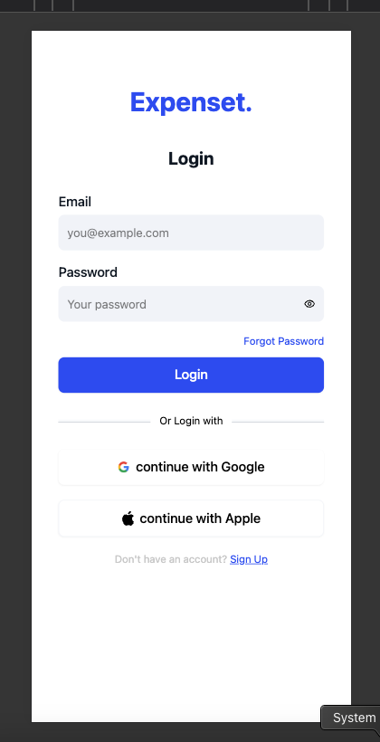
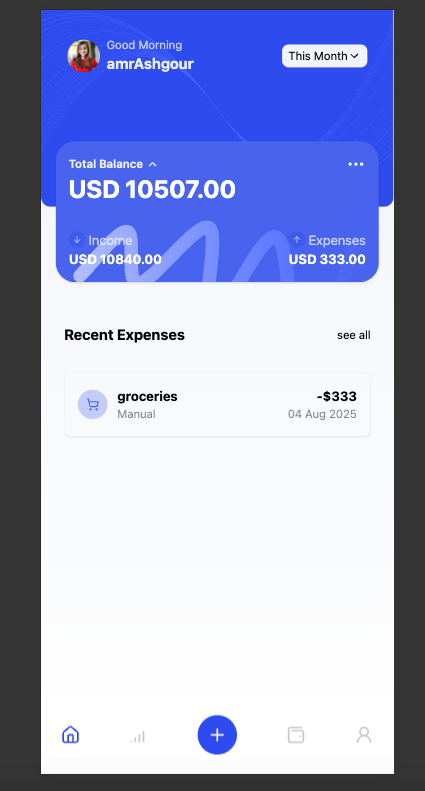
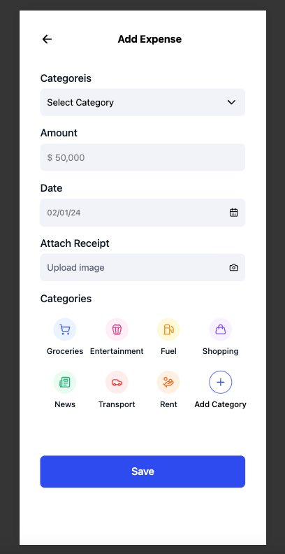

# Expense-Tracker 📊

A modern, responsive expense tracking application built with React, TypeScript, and Tailwind CSS. Expense-Tracker helps users manage their personal finances by tracking expenses across different categories with an intuitive and beautiful user interface.

## ✨ Features

- **User Authentication**: Secure login system with local storage
- **Expense Management**: Add, view, and categorize expenses
- **Category System**: Predefined expense categories (Groceries, Entertainment, Fuel, Shopping, News, Transport, Rent)
- **Multi-Currency Support**: Built-in currency conversion rates for 100+ currencies
- **Responsive Design**: Mobile-first design with Tailwind CSS
- **Modern UI Components**: Built with Radix UI primitives and custom components
- **Type Safety**: Full TypeScript implementation
- **Testing**: Vitest testing framework with React Testing Library

## 🚀 Tech Stack

### Frontend Framework
- **React 19.1.1** - Modern React with latest features
- **TypeScript 5.8.3** - Type-safe development
- **Vite 7.1.0** - Fast build tool and dev server

### Styling & UI
- **Tailwind CSS 4.1.11** - Utility-first CSS framework
- **Radix UI** - Accessible UI primitives
- **Lucide React** - Beautiful icon library
- **Motion** - Animation library for smooth transitions
- **React Day Picker** - Date picker component
- **Class Variance Authority** - Component variant management
- **CLSX & Tailwind Merge** - Conditional class utilities

### Routing & State
- **React Router 7.7.1** - Client-side routing
- **Sonner** - Toast notifications

### Development Tools
- **ESLint 9.32.0** - Code linting
- **Vitest 3.2.4** - Unit testing framework
- **React Testing Library** - Component testing utilities

## 📁 Project Structure

```
Expense-Tracker/
├── public/                 # Static assets
├── src/
│   ├── assets/            # Images, SVGs, and static files
│   ├── components/        # Reusable UI components
│   │   ├── AddExpense/    # Expense addition components
│   │   ├── common/        # Shared components
│   │   │   ├── MainLayout/ # Main application layout
│   │   │   └── ui/        # Basic UI components
│   │   ├── ExpensListing/ # Expense display components
│   │   └── Login/         # Authentication components
│   ├── constants/         # Application constants
│   │   ├── animations.ts  # Animation configurations
│   │   ├── categories.ts  # Expense categories
│   │   └── currencies.ts  # Currency conversion rates
│   ├── lib/               # Utility functions
│   ├── pages/             # Page components
│   ├── routes/            # Routing configuration
│   ├── types/             # TypeScript type definitions
│   └── test/              # Test files and setup
├── package.json           # Dependencies and scripts
├── tsconfig.json          # TypeScript configuration
├── vite.config.ts         # Vite build configuration
└── vitest.config.ts       # Testing configuration
```

## 🧱 Architecture & Structure

- **App type**: Single Page Application built with React and Vite
- **Routing**: Client-side routing with protected routes in `src/routes/AppRoutes.tsx`. Auth state is derived from `localStorage` key `userInfo` and unauthenticated users are redirected to `Login`.
- **State & persistence**:
  - UI state managed with React hooks
  - Expenses and auth data are stored in `localStorage` (`expenses`, `userInfo`)
- **Pages**:
  - `Login` for authentication
  - `ExpenseListing` for filtering, listing, and paginating expenses
  - `AddExpense` for creating new expenses
- **Components**: Feature-first folders under `src/components`, with shared UI primitives under `src/components/common/ui`.

## 🔌 API Integration

This version is fully client-side and does not call external APIs. Data is persisted in the browser using `localStorage`.

If a backend is introduced later, the planned approach is:
- Use native `fetch` wrapped by a small request utility for consistent headers and error handling
- Configure base URL and secrets via environment variables
- Map server errors to user-friendly toasts and support optimistic updates on create/delete

## 📄 Pagination Strategy

- **Type**: Local (client-side) pagination
- **Mechanism**: The list renders a slice of filtered results based on a `visibleCount`. A “Load More” action increments `visibleCount` by a fixed page size (10)
- **Reset**: Changing filters resets `visibleCount` to the first page
- **Why local**: All data resides in the browser; server-driven pagination will be added alongside API integration using query params like `?page` and `?limit`.

## 🖼️ UI Screenshots

Add real screenshots under `docs/screenshots/` and update the links below:





## 🛠️ Installation & Setup

### Prerequisites
- Node.js 18+ 
- npm

### Quick Start

1. **Clone the repository**
   ```bash
   git clone <repository-url>
   cd Expense-Tracker
   ```

2. **Install dependencies**
   ```bash
   pnpm install
   # or
   npm install
   ```

3. **Start development server**
   ```bash
   pnpm dev
   # or
   npm run dev
   ```

4. **Open your browser**
   Navigate to `http://localhost:5173`

### Available Scripts

- `pnpm dev` - Start development server
- `pnpm build` - Build for production
- `pnpm preview` - Preview production build
- `pnpm test` - Run tests
- `pnpm lint` - Run ESLint

## ▶️ How to Run the Project

1. Install dependencies: `npm install`
2. Start the dev server: `npm dev`
3. Open `http://localhost:5173`

## 🎯 Usage

### Authentication
- Users must log in to access the application
- Authentication state is managed via localStorage
- Unauthenticated users are redirected to login page

### Adding Expenses
1. Navigate to the "Add Expense" page
2. Select a category from the predefined list
3. Enter the amount 
4. Select the date
5. Submit the expense

### Viewing Expenses
- Main dashboard displays all expenses
- Expenses are organized by date and category
- Responsive card layout for easy viewing

### Categories
The application includes 7 predefined expense categories:
- Groceries
- Entertainment
- Fuel
- Shopping
- News
- Transport
- Rent

## 🐞 Known Bugs / Unimplemented Features

- No backend API integration yet; all data is local to the browser
- Login is demo-only; there is no real authentication/authorization
- Limited test coverage beyond layout and smoke tests

## 🔧 Configuration

### TypeScript
- Strict mode enabled
- ES2022 target
- JSX support for React
- Module bundler resolution

### Tailwind CSS
- Utility-first approach
- Custom color schemes
- Responsive breakpoints
- Component variants

### Testing
- Vitest as test runner
- React Testing Library for component testing
- JSDOM for DOM simulation
- Jest DOM matchers

## 🧪 Testing

Run the test suite:
```bash
npm run test
```

Run tests in watch mode:
```bash
npm run test --watch
```

## 📱 Responsive Design

The application is built with a mobile-first approach:
- Responsive navigation
- Adaptive layouts for different screen sizes
- Touch-friendly interface elements
- Optimized for both desktop and mobile devices

## 🎨 UI Components

### Core Components
- **Button** - Customizable button with variants
- **Calendar** - Date picker component
- **Dropdown Menu** - Accessible dropdown menus
- **Popover** - Contextual information display
- **Divider** - Visual separation elements

### Layout Components
- **MainLayout** - Primary application layout
- **NavigationBar** - Top navigation component
- **ExpenseCard** - Individual expense display
- **ExpenseList** - List of expenses

## 🔒 Security Features

- Local storage for user authentication
- Protected routes for authenticated users
- Input validation and sanitization
- Secure routing with React Router

## 🚀 Performance Features

- Lazy loading for route components
- Optimized bundle with Vite
- Efficient re-rendering with React 19
- CSS-in-JS optimization with Tailwind

## 🤝 Contributing

1. Fork the repository
2. Create a feature branch
3. Make your changes
4. Add tests for new functionality
5. Ensure all tests pass
6. Submit a pull request

## 📄 License

This project is private and proprietary.

## 🆘 Support

For support and questions, please contact the development team.

---

**Built with ❤️ using React, TypeScript, and Tailwind CSS**
